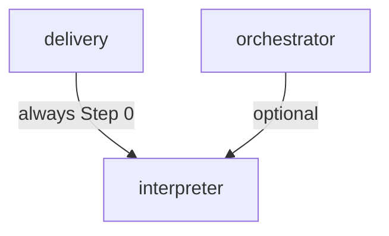

# Group — Analysis

> Navigate from graph: this index links to the flat files for the `analysis` group. Source: [`refined-source/graph.json`](../../refined-source/graph.json) (v1.0.0, 14 nodes, 27 edges).

| Field | Value |
|---|---|
| **Group id** | `analysis` |
| **Label** | Analysis |
| **Color** | `#06B6D4` |
| **Order** | 1 |
| **Members** | 1 |

## Members

| Node | Label | Level | Primary | Link |
|---|---|---|---|---|
| `interpreter` | Interpreter | 1 | no | [../interpreter.md](../interpreter.md) |

## Edges

Incident edges where `from` or `to` is a member of `analysis` (from `refined-source/graph.json#edges`).

### Incoming to this group

| From | To | Kind | Label |
|---|---|---|---|
| `delivery` | `interpreter` | always | Step 0 |
| `orchestrator` | `interpreter` | optional | — |

### Outgoing from this group

No outgoing task edges — `interpreter` is a leaf (may call `question` tool, not a graph edge).

### Visualization (Mermaid — optional)

## References

- Flat file: [../interpreter.md](../interpreter.md)
- Graph source: [`refined-source/graph.json`](../../refined-source/graph.json)
- Overview: [../README.md](../README.md)
