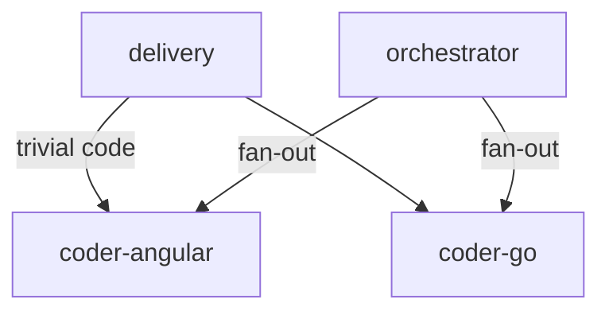

# Group — Coders

> Navigate from graph: this index links to the flat files for the `coders` group. Source: [`refined-source/graph.json`](../../refined-source/graph.json) (v1.0.0, 14 nodes, 27 edges).

| Field | Value |
|---|---|
| **Group id** | `coders` |
| **Label** | Coders |
| **Color** | `#16A34A` |
| **Order** | 3 |
| **Members** | 2 |

## Members

| Node | Label | Level | Primary | Link |
|---|---|---|---|---|
| `coder-angular` | Coder Angular | 2 | no | [../coder-angular.md](../coder-angular.md) |
| `coder-go` | Coder Go | 2 | no | [../coder-go.md](../coder-go.md) |

## Edges

Incident edges where `from` or `to` is a member of `coders` (from `refined-source/graph.json#edges`).

### Incoming to this group

| From | To | Kind | Label |
|---|---|---|---|
| `delivery` | `coder-angular` | direct | trivial code |
| `delivery` | `coder-go` | direct | — |
| `orchestrator` | `coder-angular` | fan-out | — |
| `orchestrator` | `coder-go` | fan-out | — |

### Outgoing from this group

No outgoing task edges — both coders are leaves.

### Visualization (Mermaid — optional)

## References

- Flat files: [../coder-angular.md](../coder-angular.md), [../coder-go.md](../coder-go.md)
- Graph source: [`refined-source/graph.json`](../../refined-source/graph.json)
- Overview: [../README.md](../README.md)
