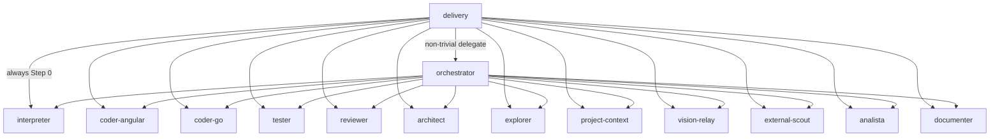

# Group — Coordination

> Navigate from graph: this index links to the flat files for the `coordination` group. Source: [`refined-source/graph.json`](../../refined-source/graph.json) (v1.0.0, 14 nodes, 27 edges).

| Field | Value |
|---|---|
| **Group id** | `coordination` |
| **Label** | Coordination |
| **Color** | `#4F46E5` |
| **Order** | 0 |
| **Members** | 2 |

## Members

| Node | Label | Level | Primary | Link |
|---|---|---|---|---|
| `delivery` | Delivery | 0 | yes | [../delivery.md](../delivery.md) |
| `orchestrator` | Orchestrator | 1 | no | [../orchestrator.md](../orchestrator.md) |

## Edges

Incident edges where `from` or `to` is a member of `coordination` (from `refined-source/graph.json#edges`).

### Outgoing from this group

| From | To | Kind | Label |
|---|---|---|---|
| `delivery` | `interpreter` | always | Step 0 |
| `delivery` | `orchestrator` | non-trivial | delegate |
| `delivery` | `coder-angular` | direct | trivial code |
| `delivery` | `coder-go` | direct | — |
| `delivery` | `tester` | direct | — |
| `delivery` | `reviewer` | direct | — |
| `delivery` | `architect` | direct | — |
| `delivery` | `explorer` | direct | — |
| `delivery` | `project-context` | direct | — |
| `delivery` | `vision-relay` | direct | — |
| `delivery` | `external-scout` | direct | — |
| `delivery` | `analista` | direct | — |
| `delivery` | `documenter` | direct | — |
| `orchestrator` | `interpreter` | optional | — |
| `orchestrator` | `coder-angular` | fan-out | — |
| `orchestrator` | `coder-go` | fan-out | — |
| `orchestrator` | `tester` | parallel | — |
| `orchestrator` | `reviewer` | parallel | — |
| `orchestrator` | `architect` | parallel | — |
| `orchestrator` | `explorer` | fan-out | — |
| `orchestrator` | `project-context` | parallel | — |
| `orchestrator` | `vision-relay` | parallel | — |
| `orchestrator` | `external-scout` | parallel | — |
| `orchestrator` | `analista` | parallel | — |
| `orchestrator` | `documenter` | parallel | — |

### Incoming to this group

| From | To | Kind | Label |
|---|---|---|---|
| `delivery` | `orchestrator` | non-trivial | delegate |

No other incoming edges ( `delivery` is level 0 primary).

### Visualization (Mermaid — optional)

## References

- Flat files: [../delivery.md](../delivery.md), [../orchestrator.md](../orchestrator.md)
- Graph source: [`refined-source/graph.json`](../../refined-source/graph.json)
- Overview: [../README.md](../README.md)
