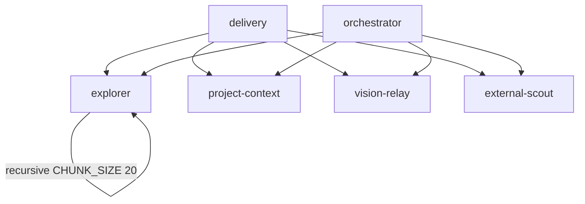

# Group — Exploration

> Navigate from graph: this index links to the flat files for the `exploration` group. Source: [`refined-source/graph.json`](../../refined-source/graph.json) (v1.0.0, 14 nodes, 27 edges).

| Field | Value |
|---|---|
| **Group id** | `exploration` |
| **Label** | Exploration |
| **Color** | `#CA8A04` |
| **Order** | 4 |
| **Members** | 4 |

## Members

| Node | Label | Level | Primary | Link |
|---|---|---|---|---|
| `explorer` | Explorer | 2 | no | [../explorer.md](../explorer.md) |
| `project-context` | Project Context | 2 | no | [../project-context.md](../project-context.md) |
| `external-scout` | External Scout | 2 | no | [../external-scout.md](../external-scout.md) |
| `vision-relay` | Vision Relay | 2 | no | [../vision-relay.md](../vision-relay.md) |

## Edges

Incident edges where `from` or `to` is a member of `exploration` (from `refined-source/graph.json#edges`).

### Incoming to this group

| From | To | Kind | Label |
|---|---|---|---|
| `delivery` | `explorer` | direct | — |
| `delivery` | `project-context` | direct | — |
| `delivery` | `vision-relay` | direct | — |
| `delivery` | `external-scout` | direct | — |
| `orchestrator` | `explorer` | fan-out | — |
| `orchestrator` | `project-context` | parallel | — |
| `orchestrator` | `vision-relay` | parallel | — |
| `orchestrator` | `external-scout` | parallel | — |
| `explorer` | `explorer` | recursive-fanout | CHUNK_SIZE 20 |

### Outgoing from this group

| From | To | Kind | Label |
|---|---|---|---|
| `explorer` | `explorer` | recursive-fanout | CHUNK_SIZE 20 |

`project-context`, `external-scout`, `vision-relay` have no outgoing edges (leaves).

### Visualization (Mermaid — optional)

## References

- Flat files: [../explorer.md](../explorer.md), [../project-context.md](../project-context.md), [../external-scout.md](../external-scout.md), [../vision-relay.md](../vision-relay.md)
- Graph source: [`refined-source/graph.json`](../../refined-source/graph.json)
- Overview: [../README.md](../README.md)
