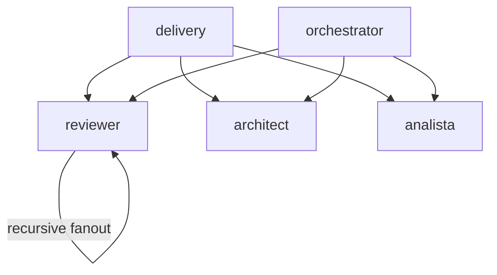

# Group — Guardians

> Navigate from graph: this index links to the flat files for the `guardians` group. Source: [`refined-source/graph.json`](../../refined-source/graph.json) (v1.0.0, 14 nodes, 27 edges).

| Field | Value |
|---|---|
| **Group id** | `guardians` |
| **Label** | Guardians |
| **Color** | `#DC2626` |
| **Order** | 2 |
| **Members** | 3 |

## Members

| Node | Label | Level | Primary | Link |
|---|---|---|---|---|
| `reviewer` | Reviewer | 2 | no | [../reviewer.md](../reviewer.md) |
| `architect` | Architect | 2 | no | [../architect.md](../architect.md) |
| `analista` | Analista | 2 | no | [../analista.md](../analista.md) |

## Edges

Incident edges where `from` or `to` is a member of `guardians` (from `refined-source/graph.json#edges`).

### Incoming to this group

| From | To | Kind | Label |
|---|---|---|---|
| `delivery` | `reviewer` | direct | — |
| `delivery` | `architect` | direct | — |
| `delivery` | `analista` | direct | — |
| `orchestrator` | `reviewer` | parallel | — |
| `orchestrator` | `architect` | parallel | — |
| `orchestrator` | `analista` | parallel | — |
| `reviewer` | `reviewer` | recursive-fanout | partition by independence |

### Outgoing from this group

| From | To | Kind | Label |
|---|---|---|---|
| `reviewer` | `reviewer` | recursive-fanout | partition by independence |

`architect` and `analista` have no outgoing edges (leaves).

### Visualization (Mermaid — optional)

## References

- Flat files: [../reviewer.md](../reviewer.md), [../architect.md](../architect.md), [../analista.md](../analista.md)
- Graph source: [`refined-source/graph.json`](../../refined-source/graph.json)
- Overview: [../README.md](../README.md)
